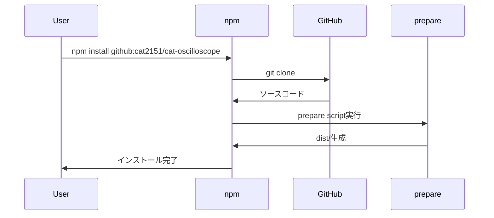
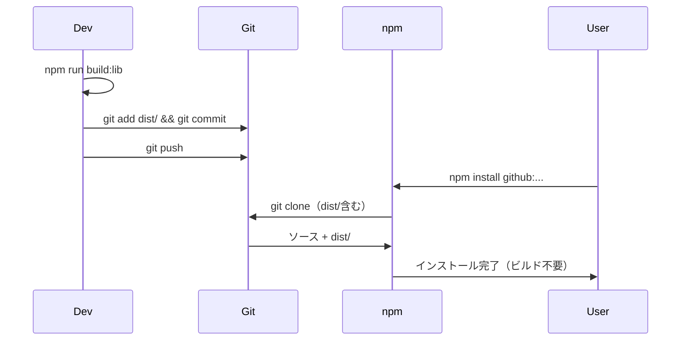

# cat-oscilloscope 配布方法の比較分析

## 概要

cat-oscilloscopeをwavlpfから利用可能にするための3つの主要な配布方法を比較分析します。

---

## 方法1: prepareスクリプトの追加

### 実装方法

`cat-oscilloscope/package.json`に以下を追加：

```json
{
  "scripts": {
    "prepare": "npm run build:lib"
  }
}
```

wavlpfの`package.json`：
```json
{
  "dependencies": {
    "cat-oscilloscope": "github:cat2151/cat-oscilloscope"
  }
}
```

### 仕組み

1. `npm install github:cat2151/cat-oscilloscope`を実行
2. npmがGitHubからソースコードをクローン
3. `prepare`スクリプトが自動実行され、`npm run build:lib`が実行される
4. `dist/`ディレクトリにビルド成果物が生成される
5. `package.json`の`main`、`module`、`types`フィールドが`dist/`内のファイルを参照

### メリット ✅

1. **Gitリポジトリがクリーン**: ビルド成果物をコミットしない
2. **ベストプラクティス準拠**: 多くのnpmパッケージで採用されている標準的な方法
3. **最新のビルド**: 常に最新のソースから自動ビルドされる
4. **実装が簡単**: package.jsonに1行追加するだけ
5. **メンテナンス不要**: ビルドファイルのコミット忘れがない
6. **差分が明確**: Gitのdiffでソースコードのみをレビューできる
7. **CI/CDでも動作**: GitHub ActionsなどのCI環境でも自動ビルドされる

### デメリット ❌

1. **インストール時間が長い**: 初回インストール時にビルドが必要（通常10-30秒）
2. **ビルド環境が必要**: Node.js、npm、TypeScriptなどのビルドツールが必要
3. **ビルド失敗のリスク**: 環境依存の問題でビルドが失敗する可能性（稀）
4. **開発依存関係のインストール**: `devDependencies`もインストールされる
5. **キャッシュが効きにくい**: Gitのコミットハッシュが変わるたびに再ビルド

### 実装時間

- **作業時間**: 5分
- **テスト時間**: 5分
- **合計**: 10分

### 採用事例

この方法は以下のような人気パッケージで採用されています：

- `typescript` - TypeScriptコンパイラ自身
- `@babel/core` - Babelトランスパイラ
- `prettier` - コードフォーマッター
- `eslint` - リンター

---

## 方法2: distファイルのコミット

### 実装方法

1. `.gitignore`から`dist/`を削除または除外パターンを調整：

```gitignore
# Before
dist/

# After
# dist/ の行を削除、または特定のファイルのみ除外
dist/*.map
dist/temp/
```

2. ビルドとコミット：

```bash
cd cat-oscilloscope
npm run build:lib
git add dist/
git commit -m "Add dist files for direct GitHub installation"
git push
```

3. wavlpfの`package.json`：

```json
{
  "dependencies": {
    "cat-oscilloscope": "github:cat2151/cat-oscilloscope"
  }
}
```

### 仕組み

1. `npm install github:cat2151/cat-oscilloscope`を実行
2. npmがGitHubからソースコード**とビルド済みファイル**をクローン
3. ビルド不要で即座に利用可能
4. `package.json`の`main`、`module`、`types`フィールドが既にある`dist/`内のファイルを参照

### メリット ✅

1. **インストールが高速**: ビルド不要で数秒で完了
2. **ビルド環境不要**: Node.js以外の追加ツールが不要
3. **確実に動作**: ビルド失敗のリスクがない
4. **開発依存関係不要**: `devDependencies`のインストールが不要
5. **キャッシュが効く**: npmキャッシュが効率的に動作
6. **CDN配信可能**: GitHub Pagesやjsdelivr経由での配信が可能
7. **即座に利用可能**: クローン後すぐに動作確認できる

### デメリット ❌

1. **リポジトリサイズ増加**: ビルド成果物がGit履歴に残り続ける
   - 例: TypeScript定義ファイル、ソースマップなど
   - 通常 100KB-1MB 程度の増加
2. **差分が複雑**: PRのdiffにビルドファイルの変更が含まれ、レビューが難しい
3. **コミット忘れのリスク**: ソースコード変更時にビルドファイルの更新を忘れる可能性
4. **マージコンフリクト**: ビルドファイルでコンフリクトが発生しやすい
5. **非標準的**: npmエコシステムでは一般的でない（ベストプラクティス違反）
6. **二重管理**: ソースとビルド成果物の両方を管理する必要
7. **自動化が困難**: CI/CDでの自動ビルド・コミットは複雑

### 実装時間

- **初回作業時間**: 10分（.gitignore調整、ビルド、コミット）
- **継続的なメンテナンス**: ソースコード変更のたびに手動ビルド・コミット
- **合計**: 初回10分 + 継続的な手間

### 採用事例

この方法は以下のような場合に限定的に使用されます：

- レガシーなライブラリ（jQuery、Lodashの古いバージョンなど）
- CDN配信専用のライブラリ（一部のUIフレームワーク）
- ビルドツールが複雑すぎて環境依存が強いライブラリ

**注意**: 現代的なnpmパッケージではほとんど採用されていません。

---

## 方法3: npmパッケージとして公開（参考）

### 実装方法

```bash
cd cat-oscilloscope
npm run build:lib
npm publish
```

wavlpfの`package.json`：
```json
{
  "dependencies": {
    "cat-oscilloscope": "^1.0.0"
  }
}
```

### メリット ✅

1. **最も標準的**: npmエコシステムの標準的な方法
2. **バージョン管理**: セマンティックバージョニングによる明確なバージョン管理
3. **高速インストール**: npmレジストリのCDNから高速ダウンロード
4. **ビルド済み配信**: npmレジストリには常にビルド済みファイルが配信される
5. **広く利用可能**: 他のプロジェクトでも簡単に利用可能
6. **信頼性が高い**: npmレジストリの高い可用性

### デメリット ❌

1. **公開が必要**: npmアカウントと公開権限が必要
2. **名前の衝突**: パッケージ名が他と重複しないか確認が必要
3. **取り消し困難**: 一度公開すると削除・変更が制限される
4. **公開の責任**: 公開パッケージの品質とセキュリティに責任を持つ

### 実装時間

- **初回作業時間**: 15-30分（npmアカウント作成、package.json調整、公開）
- **更新作業**: 5分（ビルド、バージョンアップ、公開）

---

## 詳細比較表

| 項目 | prepareスクリプト | distコミット | npm公開 |
|------|------------------|-------------|---------|
| **インストール速度** | 遅い（30秒） | 速い（5秒） | 最速（3秒） |
| **リポジトリサイズ** | 小 | 大 | N/A |
| **ビルド環境** | 必要 | 不要 | 不要 |
| **メンテナンス** | 自動 | 手動 | 自動 |
| **標準的な方法** | ✅ はい | ❌ いいえ | ✅ はい |
| **CI/CD対応** | ✅ 完全対応 | ✅ 対応 | ✅ 完全対応 |
| **差分レビュー** | ✅ 明確 | ❌ 複雑 | ✅ 明確 |
| **実装の簡単さ** | ✅ 非常に簡単 | ⚠️ やや複雑 | ⚠️ やや複雑 |
| **バージョン管理** | Gitタグ | Gitタグ | ✅ セマンティックバージョニング |
| **公開範囲** | プライベート可 | プライベート可 | 公開のみ |
| **実装時間** | 10分 | 初回10分+継続的 | 30分 |

---

## 推奨ランキング

### 1位: prepareスクリプト（推奨） 🥇

**理由**:
- ✅ 標準的なベストプラクティス
- ✅ 実装が簡単（10分）
- ✅ メンテナンスフリー
- ✅ Gitリポジトリがクリーン
- ✅ CI/CDで完全動作

**採用すべき場合**:
- cat-oscilloscopeをnpmに公開する予定がない場合
- プライベートリポジトリとして管理したい場合
- **wavlpfの現在の状況に最適**

**実装手順**:
```bash
# cat-oscilloscopeリポジトリで
cd cat-oscilloscope
# package.jsonに "prepare": "npm run build:lib" を追加
git add package.json
git commit -m "Add prepare script for GitHub installation"
git push

# wavlpfリポジトリで
cd wavlpf
# package.jsonを以下に変更:
# "cat-oscilloscope": "github:cat2151/cat-oscilloscope"
npm install
```

---

### 2位: npm公開 🥈

**理由**:
- ✅ 最も標準的
- ✅ バージョン管理が明確
- ✅ インストールが最速
- ❌ 公開の責任が伴う

**採用すべき場合**:
- cat-oscilloscopeを他のプロジェクトでも使いたい場合
- 公開ライブラリとして管理したい場合
- セマンティックバージョニングで明確に管理したい場合

---

### 3位: distコミット 🥉

**理由**:
- ✅ インストールは速い
- ❌ 非標準的
- ❌ メンテナンス負荷が高い
- ❌ Gitリポジトリが肥大化

**採用すべき場合**:
- 緊急の一時的な対応が必要な場合
- ビルド環境の構築が困難な場合
- **長期的には推奨されない**

**実装手順**（参考）:
```bash
# cat-oscilloscopeリポジトリで
cd cat-oscilloscope

# .gitignoreを編集（dist/を削除またはコメントアウト）
# .gitignore
# dist/  ← この行を削除

npm run build:lib
git add dist/
git commit -m "Add dist files for direct installation"
git push
```

---

## wavlpfにおける具体的な推奨

### 現在の状況
- cat-oscilloscopeはプライベートリポジトリ
- npm公開の予定は不明
- CI/CDでの利用が必須
- メンテナンス工数を最小化したい

### 推奨アクション: prepareスクリプト

**理由**:
1. **最小の工数**: package.jsonに1行追加するだけ
2. **標準的**: npmエコシステムのベストプラクティス
3. **メンテナンスフリー**: 継続的な手作業が不要
4. **CI対応**: GitHub Actionsで自動動作
5. **柔軟性**: 将来npm公開する際も問題なし

**実装コスト**: 10分

**継続的コスト**: ゼロ（自動化）

### 代替案: npm公開

将来的に以下の場合はnpm公開を検討：
- cat-oscilloscopeを複数のプロジェクトで使用する
- 公開ライブラリとしてコミュニティに貢献したい
- より厳密なバージョン管理が必要

---

## 技術的な詳細

### prepareスクリプトの動作フロー



### distコミットの動作フロー



---

## 結論

### wavlpfの現状に最適な方法: **prepareスクリプト** 🏆

**理由のまとめ**:
1. ✅ 実装が最も簡単（10分）
2. ✅ 標準的なベストプラクティス
3. ✅ メンテナンス不要
4. ✅ CI/CDで完全動作
5. ✅ Gitリポジトリがクリーン
6. ✅ 将来の拡張性が高い

**次のアクション**:

```bash
# cat-oscilloscopeリポジトリで実施
# 1. package.jsonに "prepare": "npm run build:lib" を追加
# 2. コミット・プッシュ

# wavlpfリポジトリで実施
# 1. package.jsonの依存関係を "github:cat2151/cat-oscilloscope" に変更
# 2. npm install
# 3. CI成功を確認
```

---

**作成日**: 2026-01-14  
**推奨方法**: prepareスクリプト  
**代替方法**: npm公開（長期的）  
**非推奨**: distコミット（メンテナンス負荷が高い）
